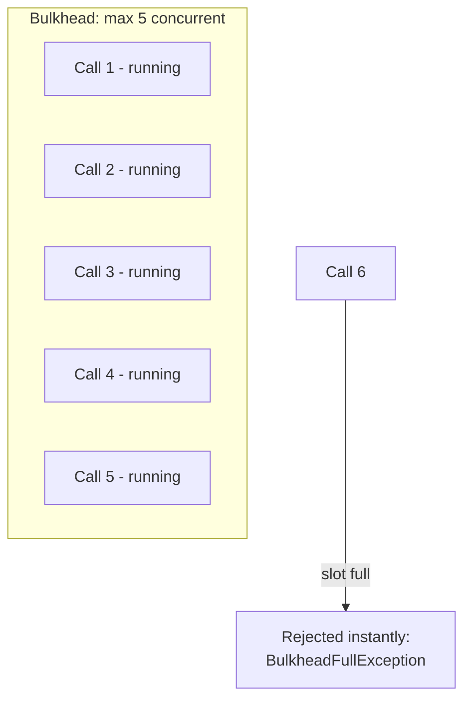

# Bulkhead

## The question it answers
"Have I got too many of these particular calls in flight at the same time?"

## Why it exists — the name is the explanation
Named after ship bulkheads: watertight compartments so that if one section floods, the whole ship
doesn't sink. Applied to software: if calls to one downstream dependency (say, Cards) start piling up
because Cards is slow, a bulkhead caps how many of those calls can be in flight *concurrently* — so they
can't consume every available thread and starve calls to *other* dependencies (Loans, the database) that
are perfectly healthy.

This is a different failure mode from what Circuit Breaker and Rate Limiter solve:
- Circuit Breaker: "is this dependency *failing*?"
- Rate Limiter: "am I calling this dependency too *often* over time?"
- Bulkhead: "do I have too many of these calls happening *right now, at once*?"

You can have a healthy, fast-responding, low-failure-rate dependency that still needs a bulkhead, simply
because a sudden burst of concurrent calls to it could exhaust shared thread pools.

## How it works



Two implementations in Resilience4j:
- **Semaphore-based Bulkhead** (what this repo uses) — limits concurrent calls on the *calling* thread
  itself using a semaphore. Lightweight, no extra thread pool.
- **ThreadPoolBulkhead** — runs calls on a dedicated thread pool with a bounded queue, returning a
  `CompletableFuture`. Heavier, but fully isolates slow calls from the caller's own threads.

## Configuration (application.yml)

```yaml
resilience4j:
  bulkhead:
    instances:
      loansBulkHead:
        maxConcurrentCalls: 10
        maxWaitDuration: 0            # 0 = reject instantly if full, don't queue
```

| Property | Plain meaning |
|---|---|
| `maxConcurrentCalls` | How many calls to this dependency may be in flight at once |
| `maxWaitDuration` | How long an incoming call will wait for a free slot before giving up |

## Applying it — functional / Supplier style (what this repo uses)
```java
Bulkhead bulkhead = bulkheadRegistry.bulkhead("loansBulkHead");

Decorators.ofSupplier(() -> loansFeignClient.fetchLoanDetails(correlationId, mobileNumber))
    .withBulkhead(bulkhead)
    .get();
```

## The exception it throws
`io.github.resilience4j.bulkhead.BulkheadFullException` — same class name for both the semaphore-based
and thread-pool-based variants.

## Common mistakes
- **Sharing one bulkhead across unrelated dependencies.** Defeats the entire purpose — the whole point is
  isolating one dependency's concurrency from another's. Give each downstream dependency its own named
  bulkhead instance.
- **Letting `BulkheadFullException` count as a Circuit Breaker failure.** Same issue as the Rate Limiter:
  a full bulkhead means *you* have too many calls in flight, not that the downstream service is broken.
  See `06-decorator-order-and-composition.md`.
