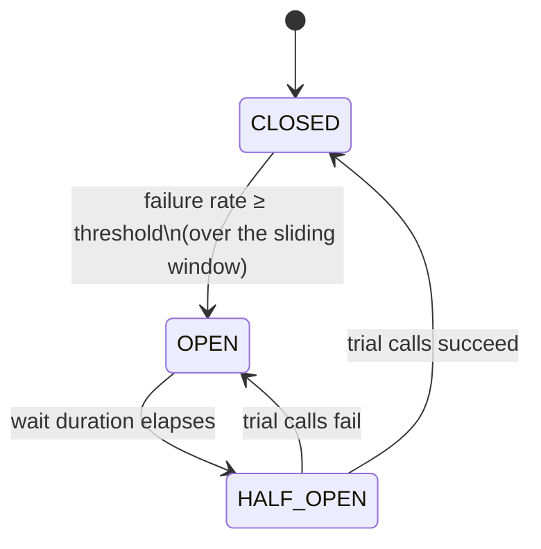

# Circuit Breaker

## The question it answers
"This downstream service keeps failing — should I even bother calling it right now, or should I fail
fast and save everyone the wait?"

## Why it exists
Without it: every incoming request keeps trying to call a downstream service that's already down,
each one waiting out a full timeout before giving up. That's the worst possible outcome — you get all
the delay of a working system with none of the success. The Circuit Breaker's job is to notice the
pattern of failure and stop making the attempt at all, for a while.

## How it works — the state machine



- **CLOSED** — normal operation. Every call goes through to the real downstream service. The breaker
  keeps a rolling record (the "sliding window") of the last N calls (or last N seconds) and tracks what
  % failed.
- **OPEN** — the failure rate crossed the configured threshold. The breaker stops calling the real
  service entirely. Every call is rejected **immediately**, without even attempting the network call,
  by throwing `CallNotPermittedException`.
- **HALF_OPEN** — after `waitDurationInOpenState` elapses, the breaker lets a small number of "trial"
  calls through to see if the downstream service has recovered. If they succeed → back to CLOSED. If
  they fail → back to OPEN, and the wait timer restarts.

## Configuration (application.yml)

```yaml
resilience4j:
  circuitbreaker:
    instances:
      loansBreaker:
        slidingWindowType: COUNT_BASED       # or TIME_BASED
        slidingWindowSize: 10                # look at the last 10 calls
        minimumNumberOfCalls: 5              # don't even evaluate failure rate until 5 calls happened
        failureRateThreshold: 50             # 50% of those calls failing → trip to OPEN
        waitDurationInOpenState: 10s         # stay OPEN for 10s before trying HALF_OPEN
        permittedNumberOfCallsInHalfOpenState: 3
        automaticTransitionFromOpenToHalfOpenEnabled: false
        ignoreExceptions:
          - io.github.resilience4j.ratelimiter.RequestNotPermitted
          - io.github.resilience4j.bulkhead.BulkheadFullException
```

| Property | Plain meaning |
|---|---|
| `slidingWindowType` | Judge the last N *calls* (`COUNT_BASED`) or the last N *seconds* (`TIME_BASED`)? |
| `slidingWindowSize` | How many calls/seconds make up "recent history" |
| `minimumNumberOfCalls` | Don't trip the breaker off 1 unlucky call — wait for at least this many data points |
| `failureRateThreshold` | % failures in the window that trips the breaker |
| `waitDurationInOpenState` | How long to stay OPEN before allowing a trial call |
| `permittedNumberOfCallsInHalfOpenState` | How many trial calls to allow through in HALF_OPEN |
| `ignoreExceptions` | Exception types that should **not** count as a failure at all (transparently rethrown, not recorded) |

`ignoreExceptions` matters a lot in practice — see
[`06-decorator-order-and-composition.md`](06-decorator-order-and-composition.md) for why `RequestNotPermitted`
and `BulkheadFullException` specifically should never count toward this breaker's failure rate.

## Applying it — annotation style
```java
@CircuitBreaker(name = "loansBreaker", fallbackMethod = "loanFallback")
public LoansDto getLoans(String mobileNumber) {
    return loansFeignClient.fetchLoanDetails(mobileNumber);
}

private LoansDto loanFallback(String mobileNumber, CallNotPermittedException ex) {
    return LoansDto.empty();
}
```

## Applying it — functional / Supplier style (what this repo uses)
```java
CircuitBreaker loanCircuitBreaker = registry.circuitBreaker("loansBreaker");

ResponseEntity<LoansDto> result = Decorators.ofSupplier(
        () -> loansFeignClient.fetchLoanDetails(correlationId, mobileNumber))
    .withCircuitBreaker(loanCircuitBreaker)
    .get();
```

## The exception it throws
- **Breaker OPEN / HALF_OPEN with no permits left** → `io.github.resilience4j.circuitbreaker.CallNotPermittedException`
  — thrown instantly, no network call attempted.
- **Breaker CLOSED** → no special exception. Whatever the real call throws (`FeignException`,
  `RetryableException`, etc.) propagates normally, and is recorded as a success/failure based on
  `recordExceptions`/`ignoreExceptions` config.

## Common mistakes
- **One breaker per method that calls two different services.** If a single `@CircuitBreaker` annotation
  wraps a method that calls both Loans and Accounts, a failure in *either* trips the *same* breaker, and
  both get routed to the *same* fallback. You lose the ability to treat the two dependencies
  independently. Fix: one breaker instance (and, if using annotations, one method) per downstream
  dependency.
- **Not excluding self-imposed rejections.** If `RequestNotPermitted` (rate limiter) or
  `BulkheadFullException` are allowed to count as breaker failures, your own throttling can trip the
  circuit even when the real service is fine. Either use `ignoreExceptions`, or (better, for functional
  composition) order the decorators so the breaker sits closer to the real call than the rate
  limiter/bulkhead — see `06-decorator-order-and-composition.md`.**
