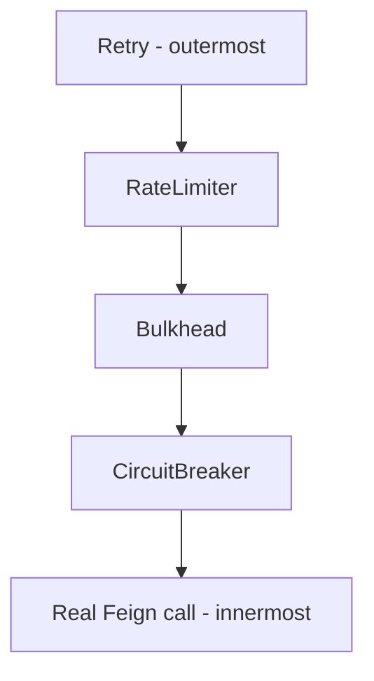

# Decorator Order and Composition

This is the single most important doc in this repo. Getting the order wrong doesn't cause a compile
error or an obvious bug — it causes a resilience system that quietly fails in the wrong way, which is
much worse than not having one.

## The rule that matters most

> A pattern's rejection should only count as a Circuit Breaker "failure" if it's actually evidence the
> **downstream service** is unhealthy. If the rejection is caused by **your own** self-imposed limits
> (Rate Limiter, Bulkhead), it should never count.

Why this matters concretely: if `RequestNotPermitted` or `BulkheadFullException` are allowed to trip the
Circuit Breaker, then a sudden burst of *your own* traffic — nothing to do with the downstream service's
actual health — can flip the breaker OPEN. Now every user gets the fallback response, even though the
real Loans/Cards service was never actually struggling.

Retry is different — it's not a rejection, it's a real repeated attempt against the real service, so its
outcomes *should* be visible to the breaker.

## Resilience4j's own default order (annotations)

If you stack annotations, Spring AOP applies them in this fixed, documented default order (outermost to
innermost):

```
Retry ( CircuitBreaker ( RateLimiter ( TimeLimiter ( Bulkhead ( real call ) ) ) ) )
```

Notice: RateLimiter and Bulkhead sit **inside** CircuitBreaker's watched scope. That means, by default,
their rejections **do** count as CircuitBreaker failures — the exact problem described above. This is a
known, documented rough edge in Resilience4j (see their GitHub issue #1657) — the default order is not
necessarily the order you actually want.

You *can* override it via properties:
```yaml
resilience4j:
  retry:
    retryAspectOrder: 5
  circuitbreaker:
    circuitBreakerAspectOrder: 4
  ratelimiter:
    rateLimiterAspectOrder: 3
  bulkhead:
    bulkheadAspectOrder: 2
```
(higher number = applied earlier / more "outer"). Almost nobody actually does this — it's easy to miss
and easy to configure inconsistently. The alternative, and the one used in this repo, is `ignoreExceptions`
on the Circuit Breaker (see `docs/01-circuit-breaker.md`) — simpler and works regardless of annotations
vs functional style.

## Functional/Supplier composition: you control the order directly

This is the real advantage of the style this repo uses. There is no fixed order — the order you chain
`.withX(...)` calls **is** the order, and it works like nested boxes:

**The call added *first* ends up *innermost*** (closest to the real call). **The call added *last* ends
up *outermost*.**

```java
Decorators.ofSupplier(() -> loansFeignClient.fetchLoanDetails(correlationId, mobileNumber))
    .withCircuitBreaker(loanCircuitBreaker)   // added 1st → innermost
    .withBulkhead(bulkhead)                   // added 2nd
    .withRateLimiter(loanRateLimiter)         // added 3rd
    .withRetry(loansRetry)                    // added 4th → outermost
    .get();
```

This produces, outer to inner:

```
Retry ( RateLimiter ( Bulkhead ( CircuitBreaker ( real call ) ) ) )
```



**Why this order, specifically:**

1. **Retry outermost** — if the entire pipeline below fails, decide whether to redo the whole attempt.
2. **RateLimiter next** — reject before consuming a bulkhead slot or bothering the breaker at all, if
   we're already over our own call budget.
3. **Bulkhead next** — cap concurrency before reaching the breaker.
4. **CircuitBreaker innermost, right next to the real call** — this is the key fix. Because RateLimiter
   and Bulkhead now sit *outside* the breaker, a rejection from either of them **never reaches the
   breaker at all** — the breaker is simply never invoked, so it can't possibly record it as a failure.
   Only genuine outcomes of the real call (success, `RetryableException`, `FeignException`, etc.) are
   visible to it.

## What the original (buggy) version of this repo's code did wrong

```java
// WRONG ORDER — from the very first draft of CustomersServiceImpl
Decorators.ofSupplier(() -> loansFeignClient.fetchLoanDetails(correlationId, mobileNumber))
    .withRateLimiter(rateLimiter)     // added 1st → innermost
    .withBulkhead(bulkhead)
    .withCircuitBreaker(loanCircuitBreaker)
    .withRetry(loansRetry)            // added last → outermost
    .get();
```

This produces `Retry(CircuitBreaker(Bulkhead(RateLimiter(call))))` — CircuitBreaker is **outside**
RateLimiter and Bulkhead, meaning it wraps and watches them. Every `RequestNotPermitted` and
`BulkheadFullException` thrown by the inner layers propagates *through* the breaker's watched scope and
gets recorded as a failure, right alongside genuine downstream failures. Fixed in the current version of
`CustomersServiceImpl.java` in this repo using the order above.

## Quick reference: what should and shouldn't count as a Circuit Breaker failure

| Exception | Caused by | Should count as CB failure? |
|---|---|---|
| `RequestNotPermitted` | Your own rate limiting | **No** — self-imposed, not downstream health |
| `BulkheadFullException` | Your own concurrency cap | **No** — self-imposed, not downstream health |
| `feign.RetryableException` | Real network failure/timeout talking to the actual service | **Yes** — genuine signal |
| A normal `FeignException` (4xx/5xx from the real service) | The real service actually responded with an error | Usually yes, though you may want to exclude expected 4xx client errors via `ignoreExceptions` |
| `CallNotPermittedException` | The breaker is already OPEN | N/A — the call is rejected by the breaker itself, this can't recursively count against it |
