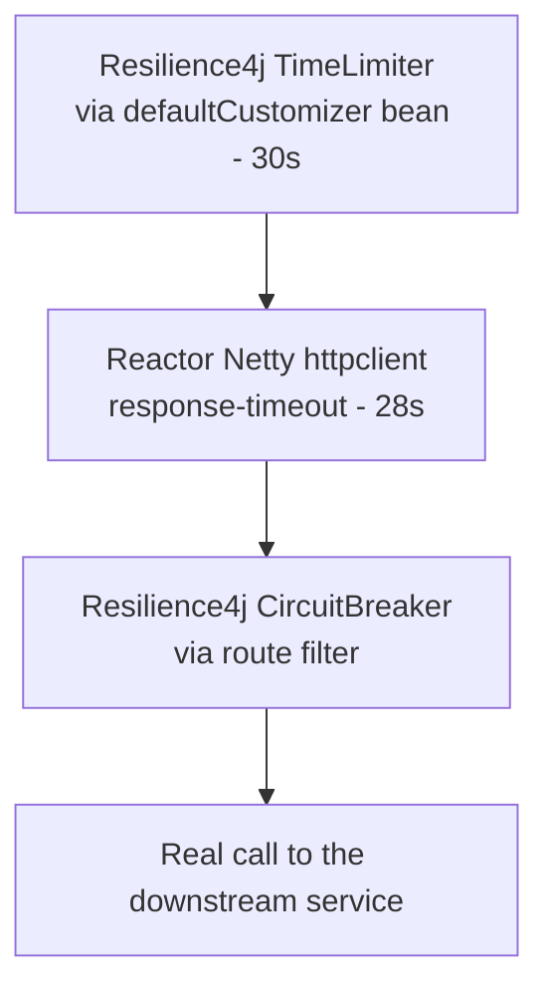
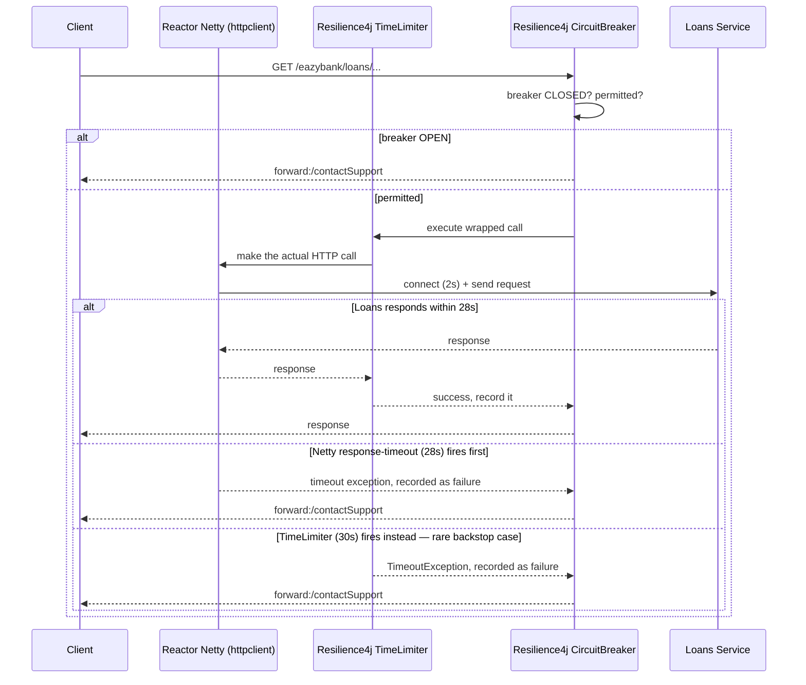

# Gateway-Level Resilience (Spring Cloud Gateway + Resilience4j)

Scope of this doc: resilience **at the API Gateway specifically** — not inside individual microservices.
The gateway implements resilience differently from a downstream service (reactive, no business logic, its
own HTTP client instead of Feign), so it gets its own explanation, its own code file
(`GatewayserverApplication.java`), and its own config (`application.yml`), all in this one folder.

---

## Why the gateway needs a different approach than a microservice

- **It's reactive (WebFlux), not Servlet.** Everything here is `Mono`-based under the hood.
- **It doesn't use Feign.** It proxies to downstream services with its own built-in HTTP client
  (Reactor Netty), configured directly, not through a Feign client interface.
- **It has no business/domain logic.** It doesn't know what a specific request to `/loans/**` actually
  *does* — whether it's a safe read or a mutating write. That single fact is what rules out an entire
  resilience pattern at this layer (Retry — see the dedicated section near the bottom).
- **Its job is narrow and specific:** decide fast whether to even attempt a call, cap how long to wait,
  and degrade gracefully if either fails. Nothing more.

---

## Dependencies (Maven)

```xml
<dependencies>
    <!-- Reactive gateway itself -->
    <dependency>
        <groupId>org.springframework.cloud</groupId>
        <artifactId>spring-cloud-starter-gateway</artifactId>
    </dependency>

    <!-- Spring Cloud's circuit breaker abstraction, backed by Resilience4j, reactive variant -->
    <dependency>
        <groupId>org.springframework.cloud</groupId>
        <artifactId>spring-cloud-starter-circuitbreaker-reactor-resilience4j</artifactId>
    </dependency>

    <!-- Required because routes use lb://SERVICE-NAME style URIs — "lb" means "resolve this
         service name via service discovery and load-balance across its instances" -->
    <dependency>
        <groupId>org.springframework.cloud</groupId>
        <artifactId>spring-cloud-starter-netflix-eureka-client</artifactId>
    </dependency>
    <dependency>
        <groupId>org.springframework.cloud</groupId>
        <artifactId>spring-cloud-starter-loadbalancer</artifactId>
    </dependency>
</dependencies>
```

Note what's deliberately **not** here: no `spring-boot-starter-web` (this app is reactive — mixing it
with the Servlet starter in the same gateway app is a common source of confusing startup errors), and no
raw `resilience4j-spring-boot3` starter — the `circuitbreaker-reactor-resilience4j` starter already
brings what's needed for the `Customizer<ReactiveResilience4JCircuitBreakerFactory>` bean pattern used
below.

---

## The three layers a request actually passes through



| Layer | What it's actually asking | Configured where |
|---|---|---|
| Reactor Netty `httpclient` | "Can I connect, and did a full response arrive in time?" — the lowest level, closest to the wire | `application.yml` |
| Resilience4j `TimeLimiter` | "Has this whole reactive call taken too long overall?" — a backstop above Netty | `defaultCustomizer` bean |
| Resilience4j `CircuitBreaker` | "Is this route healthy enough to even attempt right now?" | route filter (`.circuitBreaker(...)`) + `defaultCustomizer` bean |

**Why 28s and 30s, not the same number for both:** with equal durations, it becomes a race which timer
fires first, making the actual failure mode (and the exception type you'd see in logs) inconsistent from
one request to the next. Keeping Netty's `response-timeout` (28s) strictly below the `TimeLimiter` (30s)
means the lower, closer-to-the-wire layer is always the one that fires deterministically on a genuinely
slow network call — the `TimeLimiter` becomes a pure backstop for anything that stalls elsewhere in the
reactive pipeline, not a redundant duplicate measurement of the same thing.

---

## The code: `GatewayserverApplication.java`

Full file is alongside this doc. Two things in it, walked through below: the `RouteLocator` bean (three
routes) and the `defaultCustomizer` bean (shared resilience config for all three).

### The `RouteLocator` — one route shown, the other two are structurally identical

```java
.route(p -> p
        .path("/eazybank/loans/**")
        .filters(f -> f.rewritePath("/eazybank/loans/(?<segment>.*)", "/${segment}")
                .circuitBreaker(config -> config.setName("loan")
                        .setFallbackUri("forward:/contactSupport"))
                .addResponseHeader("X-Response-Time", LocalDateTime.now().toString()))
        .uri("lb://LOANS"))
```

- **`.path(...)`** — matches any request under this prefix.
- **`.rewritePath(...)`** — strips the `/eazybank/loans` prefix before forwarding, so the downstream
  service sees a clean internal path.
- **`.circuitBreaker(config -> config.setName("loan").setFallbackUri("forward:/contactSupport"))`** —
  wraps this route in a circuit breaker named `"loan"`. That name is the lookup key the
  `defaultCustomizer` bean uses. `forward:/contactSupport` is an **internal** forward to a local
  controller in this same gateway app on trip — not an external redirect, no extra network hop.
- **`.uri("lb://LOANS")`** — resolves `LOANS` via the service discovery client and load-balances across
  whatever instances are currently registered under that name.

`account` and `card` routes follow the exact same shape, each with their own breaker name — three
independent breaker instances, one per downstream dependency, never one shared breaker across all three
(that would mean a Cards outage could trip the same breaker guarding Loans traffic).

### The `defaultCustomizer` bean

```java
@Bean
public Customizer<ReactiveResilience4JCircuitBreakerFactory> defaultCustomizer() {
    return factory -> factory.configureDefault(id -> new Resilience4JConfigBuilder(id)
            .circuitBreakerConfig(CircuitBreakerConfig.ofDefaults())
            .timeLimiterConfig(TimeLimiterConfig.custom()
                    .timeoutDuration(Duration.ofSeconds(30))
                    .build())
            .build());
}
```

- **`factory.configureDefault(id -> ...)`** — sets one shared config template applied to *every* circuit
  breaker this factory creates that doesn't have a more specific per-name override. All three routes
  (`"account"`, `"loan"`, `"card"`) get this identical config, since none registers its own override.
- **`CircuitBreakerConfig.ofDefaults()`** — Resilience4j's stock settings: 50% failure rate trips it,
  evaluated over the last 100 calls (count-based sliding window), stays OPEN for 60s before trying
  HALF_OPEN.
- **`TimeLimiterConfig.custom().timeoutDuration(Duration.ofSeconds(30))`** — overrides Resilience4j's
  own `TimeLimiterConfig.ofDefaults()`, which is a **1-second** timeout (confirmed directly from
  Resilience4j's source code). Spring Cloud's reactive circuit breaker factory wraps every protected call
  with a `TimeLimiter` automatically — without this override, every gateway call, even to a perfectly
  healthy service, would get killed after 1 second. This bean exists specifically to fix that.

---

## The config: `application.yml`

```yaml
spring:
  cloud:
    gateway:
      httpclient:
        connect-timeout: 2000    # milliseconds — TCP handshake only
        response-timeout: 28s    # full response wait
```

- **`connect-timeout: 2000`** — how long to wait for the TCP handshake alone, before any HTTP request is
  even sent. Kept short deliberately: within a cluster, a healthy host should accept a connection in
  single-digit milliseconds, so failing to connect within 2s is a strong, fast signal something is
  actually down.
- **`response-timeout: 28s`** — the full wait after the connection is open: request sent, waiting for the
  complete response.
- **This lives under `spring.cloud.gateway.httpclient`, not under `server`.** `server.*` timeouts govern
  the gateway's *inbound* side (how long it waits on whoever is calling *it*). This block governs the
  *outbound* side (how long it waits on the services *it* calls) — the side that matters for resilience
  here. Mixing these two up is a common, easy mistake.

---

## Request flow, end to end



---

## Why there's no `Retry` filter anywhere here

Look at the code: a `CircuitBreaker` per route, a shared `TimeLimiter` — but no retry, anywhere, at the
gateway. Spring Cloud Gateway *does* ship a built-in `Retry` filter, so it's worth being explicit that
this is a deliberate omission, not a gap.

**Idempotency is a business-logic decision, and the gateway has no business logic.** Deciding whether a
call is safe to replay requires knowing what that call actually *does* — is this a read, or does it
create a loan record / charge a card? The gateway proxies every request under `/eazybank/loans/**`
without knowing which specific operation each one is. The Loans service itself knows exactly what each of
its own endpoints does. The gateway structurally cannot know this.

**Retrying at both layers multiplies attempts, right when the system is already struggling.** If the
gateway retried 3× on top of Loans' own internal retry (also multiple attempts) against its own
downstream dependency, one failing request could balloon into far more real network attempts — landing on
a dependency that is, by definition, already the one struggling. Retry is supposed to smooth over
transient blips; stacked retries across layers do the opposite.

**The gateway sits in front of every route, with wildly different retry-safety per route.** A single
gateway-level retry policy has to be either safe-but-useless (skip almost everything) or
generic-but-dangerous (retry things that shouldn't be retried), because it has no per-endpoint context.
Only the service that owns a given endpoint has enough information to say "this one's safe to retry."

**Retrying an already-slow request adds latency exactly when you want to fail fast.** A retry at the
gateway, stacked on top of a retry already happening inside the service, means the user waits through
*two* backoff sequences during exactly the moment things are already degraded.

**So where does retry actually belong?** One layer down — inside the specific service that owns the
specific downstream call, where the idempotency of that exact operation is actually known. That's a
different document (you already have this side covered), not this one.

*(For completeness: Spring Cloud Gateway's `Retry` filter isn't unusable in general — for a route that is
genuinely idempotent end-to-end, typically `GET`-only, proxying to infrastructure known to have occasional
flaky blips, a conservative gateway-level retry can be reasonable. None of `account`/`loan`/`card` fit
that description here; they front mutating financial operations, so it's correctly left out.)*

---

## Quick reference

| Concern | Handled at the gateway? | Where it actually lives |
|---|---|---|
| Fail fast on a route that's clearly unhealthy | Yes — `CircuitBreaker` per route | `defaultCustomizer` bean |
| Cap how long to wait on a slow call | Yes — two layers, deliberately staggered | `TimeLimiter` (30s) + Netty `response-timeout` (28s) |
| Graceful degradation on trip | Yes — internal forward | `setFallbackUri("forward:/contactSupport")` |
| Retry on transient failure | **No, deliberately** | Inside the specific downstream service |
| Rate limiting | Not in this codebase | Inside the specific downstream service, if needed |
| Bulkhead | Not in this codebase | Inside the specific downstream service, if needed |
