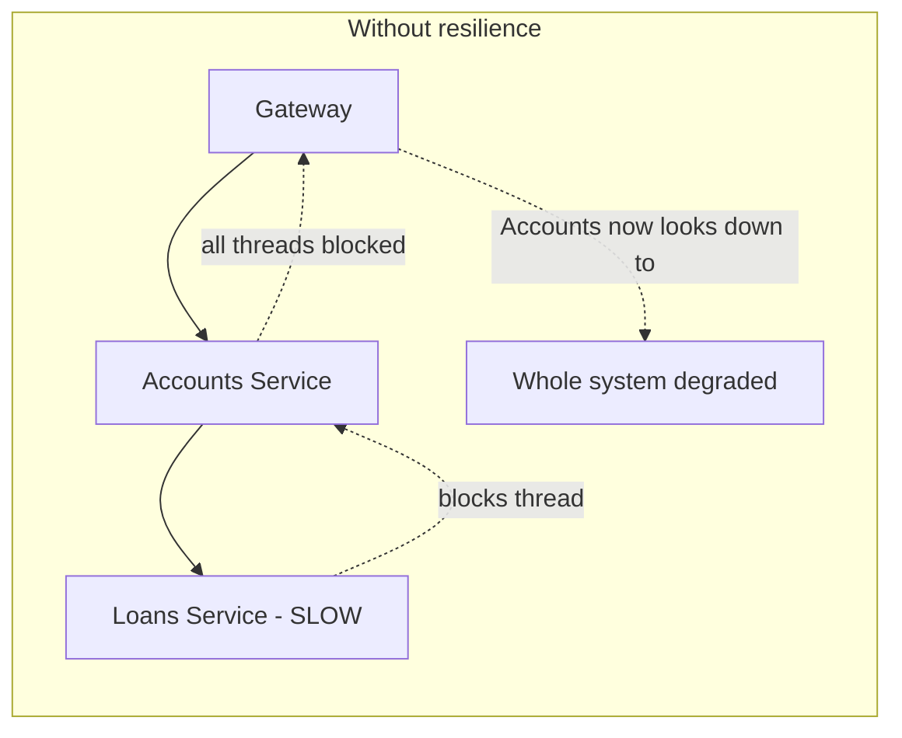
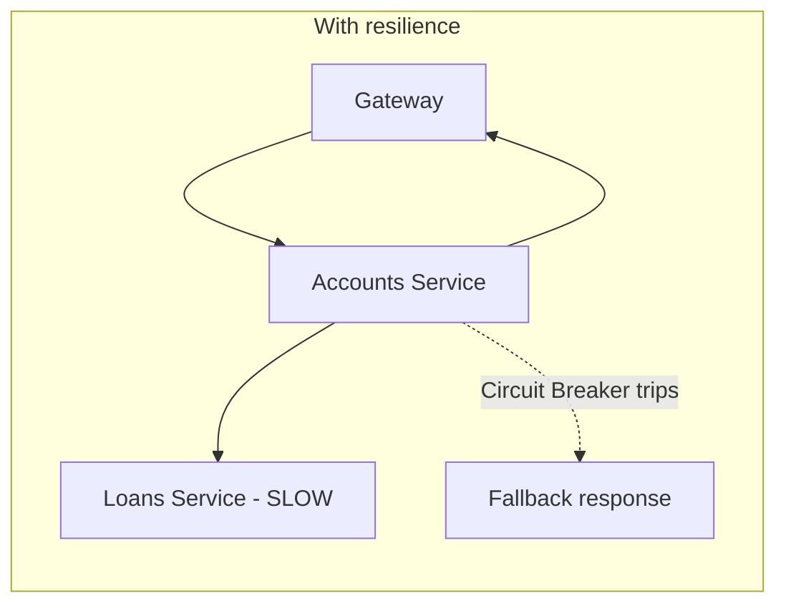

# Resilience Patterns in Microservices — My Notes

Personal reference repo for fault tolerance / resilience patterns in a Java + Spring Boot microservices
setup, using **Resilience4j**. Built while working through a real service (`CustomersServiceImpl`) that
calls two downstream microservices (Loans, Cards) via Feign.

Read this file first — it explains **why** resilience patterns exist at all. Then go pattern-by-pattern
using the links in the [Repo Map](#repo-map) section.

---

## 1. Why do we even need this?

In a monolith, if a function call fails, it fails instantly, in-process, and you get a normal Java
exception. That's it.

In microservices, "calling another service" means going over the network. The network is unreliable in
ways a local function call never is:

- The other service can be slow (not down, just slow — which is often worse than down).
- The other service can be completely unreachable (crashed, restarting, network partition).
- The other service can be *overloaded* and start failing only some requests.
- DNS can fail. Connections can time out. Packets can get dropped.

If you write microservice code the same way you write monolith code — just call the method and assume
it either works or throws — you get **cascading failure**:

One slow downstream service exhausts the calling service's thread pool. The calling service then looks
unhealthy too, even though its own code is fine. This is how a single struggling microservice takes down
services that never even had a bug — it's called a **cascading failure**, and it's the #1 reason
resilience patterns exist.

With resilience patterns, the Accounts service **detects** that Loans is unhealthy, **stops hammering
it**, returns a sensible fallback (or a partial response), and keeps its own threads free to serve other
requests. The failure stays contained to Loans instead of spreading.

**The core idea behind every pattern in this repo: assume every network call can fail, and decide in
advance exactly what happens when it does.**

---

## 2. The five patterns, in plain language

| Pattern | Plain-language question it answers | Real-world analogy |
|---|---|---|
| [Circuit Breaker](docs/01-circuit-breaker.md) | "This service keeps failing — should I even bother calling it right now?" | A fuse box: after repeated overloads, it trips and stops letting current through until things are safe again. |
| [Retry](docs/02-retry.md) | "That failure looked temporary — should I just try again?" | Redialing a phone call that dropped. |
| [Rate Limiter](docs/03-rate-limiter.md) | "Am I calling this dependency more than I'm allowed to?" | A bouncer only letting in N people per minute, no matter how many are waiting. |
| [Bulkhead](docs/04-bulkhead.md) | "Have I got too many of these calls in flight at once?" | Ship compartments — one compartment flooding doesn't sink the whole ship. |
| [Time Limiter](docs/05-time-limiter.md) | "This call is taking too long — how long do I actually wait?" | Hanging up if nobody answers after N rings. |

They solve **different problems** and are almost always used **together**, not as alternatives to each
other. A method can be rate-limited, bulkheaded, circuit-broken, and retried, all at once — that's normal,
not overkill.

---

## 3. Two ways to apply these patterns in Spring Boot

| | Annotations (declarative) | Functional / Supplier (programmatic) |
|---|---|---|
| Example | `@CircuitBreaker(name="x", fallbackMethod="f")` on a method | `Decorators.ofSupplier(() -> call()).withCircuitBreaker(cb).get()` |
| Scope | Wraps the **entire method** as one unit | Wraps a **specific call**, as small or large as you want |
| Best for | A method that calls exactly **one** downstream dependency | A method that fans out to **multiple** downstream dependencies needing different treatment |
| Decorator order | Fixed default (`Retry(CircuitBreaker(RateLimiter(TimeLimiter(Bulkhead()))))`), overridable only via properties | Fully controlled by you — the order you chain `.with...()` calls **is** the order |
| Readability | Very readable for the simple case | More verbose, but explicit — nothing hidden in AOP magic |

Full comparison with code: [`docs/07-annotations-vs-functional.md`](docs/07-annotations-vs-functional.md)

**Why this repo mostly uses the functional/Supplier style:** `CustomersServiceImpl.fetchCustomerDetails`
calls the database, the Loans service, *and* the Cards service in one method — each with different
resilience needs (Loans is mandatory and must propagate certain failures; Cards is optional and should
degrade silently). A single annotation on that method couldn't express that difference. See
[`src/.../CustomersServiceImpl.md`](src/main/java/com/eazybytes/accounts/service/impl/CustomersServiceImpl.md)
for the full walkthrough.

---

## 4. The one thing that trips everyone up: decorator order

Resilience4j patterns **compose** — you don't use just one. But the *order* you stack them in changes
behavior, sometimes badly:

- If **Bulkhead**/**RateLimiter** sit "inside" the **Circuit Breaker**'s watched scope, then your own
  self-imposed throttling can look like a downstream *failure* to the breaker, and trip it — even when
  the real downstream service is perfectly healthy.
- **Retry** should always be the outermost layer, so every individual attempt is a fresh, real signal to
  the Circuit Breaker.

Full explanation + the corrected order used in this repo's code:
[`docs/06-decorator-order-and-composition.md`](docs/06-decorator-order-and-composition.md)

---

## 5. What about huge companies — do they even use Resilience4j?

Often, no — not directly. At very large scale, this logic tends to move **out of application code and
into infrastructure**: a service mesh (Envoy/Istio sidecars) applies circuit-breaking-equivalent
("outlier detection"), retries, and timeouts as declarative config on the network proxy, invisible to the
application. gRPC-based stacks bake retry/deadline policy into the RPC framework itself.

That doesn't make this repo's contents "toy" knowledge — it's the opposite:

- Most companies (realistically, the large majority of Java/Spring Boot jobs) don't run a mesh — they run
  exactly this: Resilience4j in application code.
- Even where a mesh exists, someone has to understand *why* these patterns behave the way they do to
  configure the mesh correctly. The concepts transfer 1:1; only the mechanism changes (YAML on a proxy
  instead of Java code).
- A mesh only sees HTTP-level signals. Business-level fallback logic ("if Loans fails, still return the
  Accounts + Cards data") is still application code's job, mesh or not.

--
Read order if you're revising from scratch: this file → `docs/01` through `docs/06` in order → `docs/07`
→ `CustomersServiceImpl.md` (+ its `.java`) → `application.md` → `docs/08` + `GlobalResilienceExceptionHandler`.
