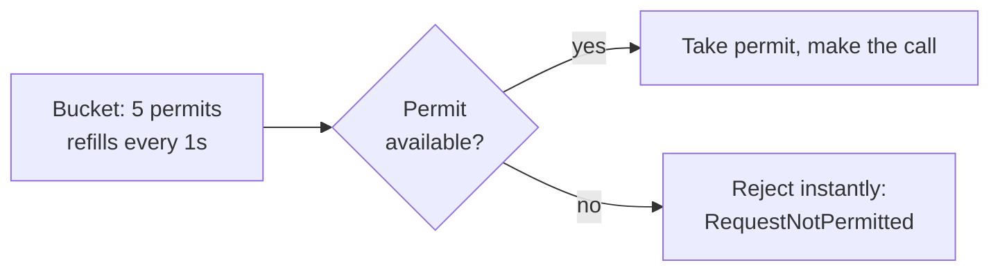

# Rate Limiter

## The question it answers
"Am I about to call this dependency more often than I'm allowed to?"

## Why it exists
Two different reasons to use this, and it matters which one you actually mean:

1. **Protect the downstream service** from being overwhelmed by *your* traffic — a shared budget across
   all callers, e.g. "this whole service may call Loans at most 50 times/second, total."
2. **Fair-use throttling per caller** — e.g. "each individual customer may trigger at most 5 loan lookups
   per minute," to stop one abusive/broken client from hogging the shared downstream budget.

These are **different designs** with different instance-naming strategies — see the gotcha below, because
this is the exact bug that was in the original version of this repo's code.

## How it works
Conceptually a token bucket: a fixed number of "permits" refill every period. A call consumes one permit.
If none are left, the call is rejected immediately rather than queued indefinitely.



## Configuration (application.yml)

```yaml
resilience4j:
  ratelimiter:
    instances:
      loanRateLimiter:
        limitForPeriod: 10           # 10 permits...
        limitRefreshPeriod: 1s       # ...refilled every 1 second
        timeoutDuration: 0           # 0 = reject instantly if no permit; don't make the caller wait
```

| Property | Plain meaning |
|---|---|
| `limitForPeriod` | How many calls are allowed per refresh window |
| `limitRefreshPeriod` | How often the permit count resets |
| `timeoutDuration` | How long a call will *wait* for a permit before giving up (`0` = fail fast) |

## Applying it — functional / Supplier style (what this repo uses)
```java
RateLimiter loanRateLimiter = rateLimiterRegistry.rateLimiter("loanRateLimiter");

Decorators.ofSupplier(() -> loansFeignClient.fetchLoanDetails(correlationId, mobileNumber))
    .withRateLimiter(loanRateLimiter)
    .get();
```

## The exception it throws
`io.github.resilience4j.ratelimiter.RequestNotPermitted` — thrown instantly, the real network call is
never attempted.

## The gotcha this repo's original code had — read this carefully

The buggy version created a rate limiter keyed by mobile number:

```java
// WRONG — creates a brand new limiter instance per customer
RateLimiter rl = rateLimiterRegistry.rateLimiter(mobileNumber + "RateLimiter", "loanRateLimiter");
```

`RateLimiterRegistry.rateLimiter(name, configName)` creates-or-returns an instance **keyed by `name`**.
Because `name` included the mobile number, every distinct customer got their *own independent* limiter,
sharing only the config values, not the actual permit count. Two consequences:

- **No real protection.** The Loans service is no longer protected by one shared budget — 10,000
  customers each get their own full 10-permits-per-second budget, so the aggregate load on Loans is
  effectively unbounded.
- **Memory leak.** The registry never evicts entries. Every unique mobile number ever seen stays in
  memory for the lifetime of the application.

**Fixed version** (what `CustomersServiceImpl.java` in this repo actually does): one shared instance,
created once and reused for every request:

```java
// RIGHT — one shared limiter, created once, protects the real shared budget
RateLimiter loanRateLimiter = rateLimiterRegistry.rateLimiter("loanRateLimiter");
```

If you genuinely want *per-customer* fair-use throttling (reason #2 above), that's a legitimate design —
but you then need your own eviction/TTL strategy on top, since Resilience4j's registry won't do it for
you. That's a deliberate extra feature, not something to reach for by accident.

## Common mistakes
- Keying the limiter name by request data (see above) when you meant a shared, service-wide limit.
- Letting `RequestNotPermitted` count as a Circuit Breaker failure — it's self-imposed throttling, not
  evidence the downstream service is unhealthy. See `06-decorator-order-and-composition.md`.
