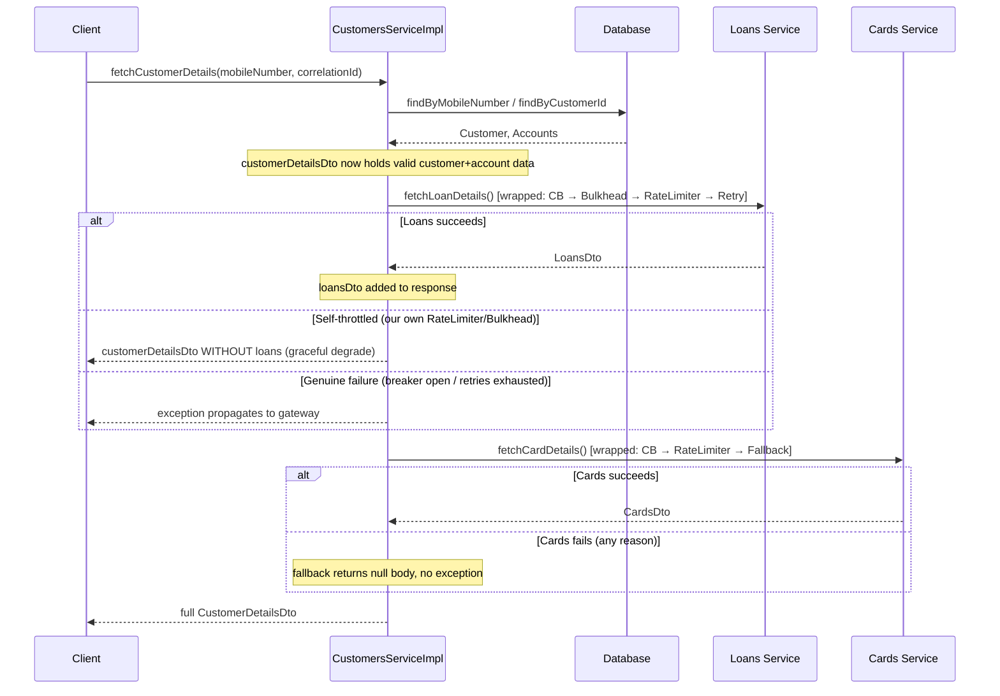

# `CustomersServiceImpl.java` — Full Walkthrough

This is the real service this whole repo was built around: `fetchCustomerDetails` aggregates data from
the local database, a mandatory Loans microservice call, and an optional Cards microservice call, into
one response DTO. It's the textbook case for **functional/Supplier-style** resilience (see
[`docs/07-annotations-vs-functional.md`](../../../../../../../docs/07-annotations-vs-functional.md))
because it fans out to multiple dependencies that each need different treatment.

## The overall flow



## Step-by-step

### Step 1–2: Database reads and base DTO
```java
Customer customer = customerRepository.findByMobileNumber(mobileNumber).orElseThrow(...);
Accounts accounts = accountsRepository.findByCustomerId(customer.getCustomerId()).orElseThrow(...);

CustomerDetailsDto customerDetailsDto = CustomerMapper.mapToCustomerDetailsDto(customer, new CustomerDetailsDto());
customerDetailsDto.setAccountsDto(AccountsMapper.mapToAccountsDto(accounts, new AccountsDto()));
```
No resilience patterns here — this is a local database call, not a network hop to another service. The
important thing for everything that follows: **`customerDetailsDto` now holds real, valid data.**
Everything downstream from here must build on top of it, never replace it with an empty object.

### Step 3: The mandatory Loans call

```java
try {
    ResponseEntity<LoansDto> loansDtoResponseEntity = Decorators.ofSupplier(
                    () -> loansFeignClient.fetchLoanDetails(correlationId, mobileNumber))
            .withCircuitBreaker(loanCircuitBreaker)   // added 1st → innermost
            .withBulkhead(loansBulkhead)               // added 2nd
            .withRateLimiter(loanRateLimiter)          // added 3rd
            .withRetry(loansRetry)                     // added 4th → outermost
            .get();
    ...
```

**Why this order:** explained fully in
[`docs/06-decorator-order-and-composition.md`](../../../../../../../docs/06-decorator-order-and-composition.md).
Short version: CircuitBreaker sits closest to the real call, so a rejection from RateLimiter or Bulkhead
never even reaches it — it simply isn't invoked in that case, so it can't record a false failure.

**What each layer actually does, in the order the call passes through them (outer → inner):**
1. `Retry` — governs whether to redo the *entire* inner chain if it ultimately fails.
2. `RateLimiter` — is this within our own allowed call rate? If not, reject instantly, no permit consumed.
3. `Bulkhead` — do we have a free concurrency slot for this dependency? If not, reject instantly.
4. `CircuitBreaker` — is the breaker CLOSED (or HALF_OPEN with permits)? If not, reject instantly. If
   permitted, make the real call and record the outcome.

**The two catch blocks — this is the part that matters most:**

```java
} catch (RequestNotPermitted | BulkheadFullException selfThrottled) {
    log.warn(...);
    return customerDetailsDto;   // <-- the data we already fetched, NOT a new empty object
```
This is the fix for the original bug. The very first draft of this method created a brand-new,
completely empty `CustomerDetailsDto` here and returned that instead — silently throwing away the
customer and account data that had already been successfully fetched two lines earlier, even though
nothing was wrong with that data. Now: if the loan call was rejected purely because of *our own*
throttling, the customer still gets a valid response with everything except loans.

```java
} catch (RuntimeException genuineFailure) {
    log.error(...);
    throw genuineFailure;
```
Loans is documented as mandatory — if the breaker is OPEN (`CallNotPermittedException`) or every retry
attempt genuinely failed against the real network/service (`feign.RetryableException`, `FeignException`),
that's treated as a real failure of the whole request, and it propagates up to
`GlobalResilienceExceptionHandler` at the gateway. See
[`docs/08-exception-reference-and-gateway-handling.md`](../../../../../../../docs/08-exception-reference-and-gateway-handling.md)
for exactly which exception maps to which HTTP status there.

### Step 4: The optional Cards call

```java
ResponseEntity<CardsDto> cardsDtoResponseEntity = Decorators.ofSupplier(
                () -> cardsFeignClient.fetchCardDetails(correlationId, mobileNumber))
        .withCircuitBreaker(cardsCircuitBreaker)
        .withRateLimiter(cardRateLimiter)
        .withFallback(cardsFailure -> {
            log.warn(...);
            return ResponseEntity.ok((CardsDto) null);
        })
        .get();
```

Cards is optional, so there's no try/catch here at all — `.withFallback(...)` handles every possible
failure (breaker open, rate-limited, real network failure, anything) by returning a `ResponseEntity`
wrapping a `null` body instead of throwing. `.withFallback(...)` is added **last**, making it the
**outermost** layer — it needs to wrap everything else in the chain to be able to catch failures from any
of them.

Why no `Bulkhead` or `Retry` here, unlike Loans? Deliberate: Cards already degrades to "just don't show
it" on any failure, so retrying costs extra latency for a call whose failure is already fully handled.
`cardsRetry` is still resolved in the constructor (in case that decision changes later) but intentionally
left out of the chain.

### Step 5: Final assembly
```java
if (cardsDtoResponseEntity != null && cardsDtoResponseEntity.getBody() != null) {
    customerDetailsDto.setCardsDto(cardsDtoResponseEntity.getBody());
}
return customerDetailsDto;
```
Null-safe on purpose — the fallback above can legitimately produce a `null` body, and this is where that
gets handled without a `NullPointerException`.

## Everything that changed from the very first draft, and why

| Bug in the original draft | Fix in this version |
|---|---|
| `RateLimiter` created fresh per request, keyed by `mobileNumber + "RateLimiter"` | Resolved **once** in the constructor, shared across all requests — see `docs/03-rate-limiter.md` |
| On `RequestNotPermitted`, returned a brand-new **empty** DTO, discarding already-fetched customer/account data | Returns the **already-populated** `customerDetailsDto`, just without loans data |
| Decorator order was `RateLimiter → Bulkhead → CircuitBreaker → Retry` (CB outermost of the three, watching RL/Bulkhead rejections as failures) | Reordered to `CircuitBreaker → Bulkhead → RateLimiter → Retry` — CB now closest to the real call, see `docs/06` |
| `catch(RuntimeException ex){ throw ex; }` did nothing but silently swallow-and-rethrow | Now logs before rethrowing, and `BulkheadFullException` is handled the same way as `RequestNotPermitted` instead of falling into the generic rethrow |
| Unused import `org.apache.hc.core5.function.Decorator` | Removed |
| Dead code: `ResponseEntity r = ResponseEntity.status(HttpStatus.OK).body(customer1);` built and never used | Removed |
| No logging anywhere | `SLF4J` logger added, with a log line at every fallback/failure branch |
