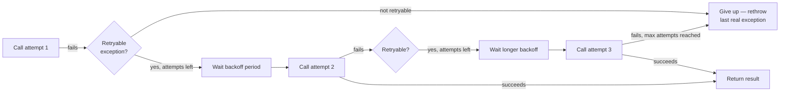

# Retry

## The question it answers
"That failure looked temporary (a blip, a dropped packet, a momentary overload) — should I just try
again before giving up?"

## Why it exists
A lot of real-world failures are transient — a connection reset, a single dropped request during a
deploy, a momentary spike in latency. Retrying a couple of times, with a short wait in between, turns
these into invisible non-events for the caller instead of hard failures.

Retry is **not** a fix for a genuinely broken or overloaded downstream service — retrying against a
service that's actually down just adds more load to an already-struggling service. That's exactly why
Retry is almost never used alone — it's paired with a Circuit Breaker so that once the breaker is OPEN,
retries stop happening against a service known to be down.

## How it works



Each retry waits a bit longer than the last (exponential backoff) so retries don't pile on top of an
already-struggling service.

## Configuration (application.yml)

```yaml
resilience4j:
  retry:
    instances:
      loansRetry:
        maxAttempts: 3
        waitDuration: 500ms
        enableExponentialBackoff: true
        exponentialBackoffMultiplier: 2
        retryExceptions:
          - feign.RetryableException
          - java.io.IOException
        ignoreExceptions:
          - io.github.resilience4j.circuitbreaker.CallNotPermittedException
```

| Property | Plain meaning |
|---|---|
| `maxAttempts` | Total attempts, **including** the first one. `3` = 1 original try + 2 retries |
| `waitDuration` | Base wait between attempts |
| `enableExponentialBackoff` | Each wait gets longer than the last, instead of a fixed gap |
| `retryExceptions` | Only retry if the failure is one of these types (be specific — don't retry validation errors!) |
| `ignoreExceptions` | Never retry these, even if they'd otherwise match — see below |

`CallNotPermittedException` belongs in `ignoreExceptions` here: if the Circuit Breaker is already OPEN,
retrying is pointless — it'll be rejected instantly every time, and you're just burning your retry budget
and delaying the fallback for no benefit.

## Applying it — annotation style
```java
@Retry(name = "loansRetry", fallbackMethod = "loanFallback")
public LoansDto getLoans(String mobileNumber) {
    return loansFeignClient.fetchLoanDetails(mobileNumber);
}
```

## Applying it — functional / Supplier style (what this repo uses)
```java
Retry loansRetry = retryRegistry.retry("loansRetry");

Decorators.ofSupplier(() -> loansFeignClient.fetchLoanDetails(correlationId, mobileNumber))
    .withRetry(loansRetry)
    .get();
```

## The exception it throws
Retry does **not** wrap failures in its own exception type by default. When all attempts are exhausted,
it simply rethrows whatever the *last* attempt actually threw (e.g. `feign.RetryableException`). The
only exception, `io.github.resilience4j.retry.MaxRetriesExceededException`, is thrown only if you set
`failAfterMaxAttempts: true`, and that's meant for **result-based** retries (retrying based on a return
value, not an exception) — not the exception-based retries used in this repo.

## Common mistakes
- **Retrying non-idempotent operations blindly.** Retrying a `POST` that creates a resource can create
  duplicates if the first attempt actually succeeded but the response was lost. Only retry safely-
  repeatable operations, or make the downstream operation idempotent (idempotency keys).
- **Retrying against an already-open circuit breaker.** Wastes attempts on guaranteed-instant rejections.
  Add `CallNotPermittedException` to `ignoreExceptions`.
- **Double retries from Feign itself.** Raw Feign has its own built-in `Retryer` that can retry
  `RetryableException` *before* Resilience4j's Retry ever sees it, silently multiplying attempts.
  Spring Cloud OpenFeign defaults this to `Retryer.NEVER_RETRY` for exactly this reason — verify no
  custom `Retryer` bean has been added anywhere in the project.
