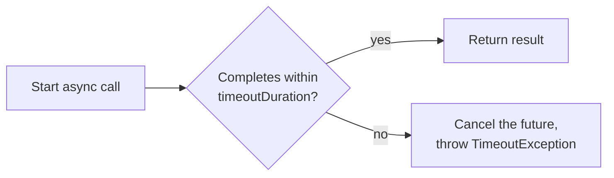

# Time Limiter

## The question it answers
"This call is taking too long — how long am I actually willing to wait before I give up on it?"

## Why it exists
A hanging call is often worse than a failed one — a thread sits blocked, holding resources, waiting for
a response that may never come. Time Limiter puts a hard ceiling on how long a single call attempt is
allowed to run before it's forcibly cancelled and treated as a failure.

## Important — this only applies to async calls
Resilience4j's `TimeLimiter` wraps a `CompletableFuture` and cancels it if it doesn't complete in time.
It does **not** apply to a plain synchronous Feign call sitting in your code the way `@Retry` or
`@CircuitBreaker` can — for a synchronous call, the actual network-level timeout comes from the HTTP
client's own connect/read timeout settings, not from Resilience4j.

**In a synchronous Feign-based service (like `CustomersServiceImpl` in this repo), you will usually
*not* see `TimeoutException` from Resilience4j.** Instead, Feign wraps the underlying connect/read
timeout — and pretty much any other network-level glitch — into `feign.RetryableException`. See
`docs/08-exception-reference-and-gateway-handling.md` for the full breakdown of this, because it's a
common point of confusion.

Where `TimeLimiter` genuinely applies: any call you've deliberately made asynchronous, e.g. wrapping a
Feign call in a `CompletableFuture.supplyAsync(...)` to run it off the request thread.

## How it works



## Configuration (application.yml)

```yaml
resilience4j:
  timelimiter:
    instances:
      loansTimeLimiter:
        timeoutDuration: 2s
        cancelRunningFuture: true
```

| Property | Plain meaning |
|---|---|
| `timeoutDuration` | Max time a single async attempt is allowed to run |
| `cancelRunningFuture` | Whether to actively interrupt/cancel the underlying thread when the timeout hits |

## Applying it — functional / Supplier style
```java
TimeLimiter timeLimiter = TimeLimiter.of("loansTimeLimiter",
        TimeLimiterConfig.custom().timeoutDuration(Duration.ofSeconds(2)).build());
ScheduledExecutorService scheduler = Executors.newScheduledThreadPool(4);

CompletableFuture<LoansDto> future = Decorators.ofSupplier(
        () -> CompletableFuture.supplyAsync(() -> loansFeignClient.fetchLoanDetails(mobileNumber)))
    .withTimeLimiter(timeLimiter, scheduler)
    .get()
    .toCompletableFuture();
```

## The exception it throws
`java.util.concurrent.TimeoutException` — this happens when the *future* doesn't complete in time. This
is distinct from `feign.RetryableException`, which is what a synchronous Feign call throws for a plain
HTTP connect/read timeout. Don't confuse the two when writing gateway-level catch logic.

## Common mistakes
- Expecting `TimeoutException` from an ordinary synchronous Feign call — it won't happen; you'll get
  `RetryableException` instead (see `docs/08`).
- Forgetting to size the `ScheduledExecutorService` reasonably — it's what actually enforces the
  cancellation, separate from your main thread pool.
